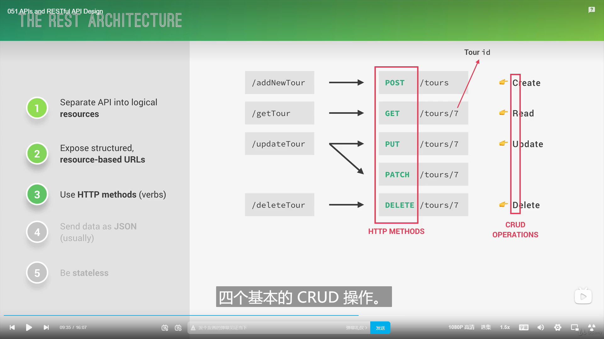

- [1. 安装express](#1-安装express)
- [2. API](#2-api)
    - [2.1. rest架构api](#21-rest架构api)
- [3. mongogose](#3-mongogose)
- [4. express常用](#4-express常用)
  - [4.1. req.query](#41-reqquery)
  - [4.2. req.params.id](#42-reqparamsid)
- [5. nodemail](#5-nodemail)


# 1. 安装express
```bash
npm install express -S
npm install cors -S
npm install mongoose@5
```
# 2. API
### 2.1. rest架构api



# 3. mongogose
https://mongoosejs.com/docs/guide.html

# 4. express常用
## 4.1. req.query
uri中的参数
例：zjhczl.xyz?name=zj&age=25
{name:"zj",age:25}
## 4.2. req.params.id
id号
例：
zjhczl.xyz/api/users/3
3

# 5. nodemail
